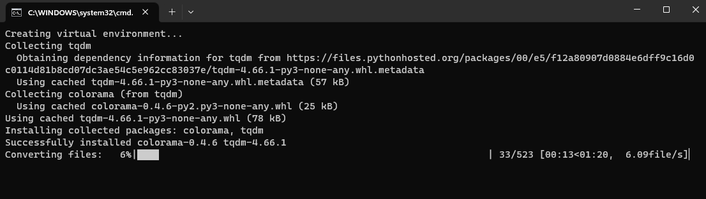

# FBX Converter Wrapper

### Purpose
Unity 3D assets usually come in the form of ASCII FBX format. Some game engines can only import binary FBX files (e.g. Flax engine). This tool uses the Autodesk FBX Converter to convert all the ASCII FBX files in a given directory into binary FBX files. The tool will replicate the directory structure of the original directory. 

### How to use

1. Download the [Autodesk FBX Converter](https://www.autodesk.com/developer-network/platform-technologies/fbx-converter-archives). 

2. Update the config.json file with the following:
  - The source directory of all your ASCII fbx files
  - The destination directory
  - The path to the FBX Converter. Make sure any Windows paths are using the `\\` double slashes.

```
{
    "source_directory": "path\\to\\source\\directory",
    "destination_directory": "path\\to\\destination\\directory",
    "fbx_converter_path": "path\\to\\FbxConverter\\2013.3\\bin\\FbxConverter.exe",
    "source_format": "FBX",
    "destination_format": "FBX",
    "fbx_mode": "binary",
    "_comment": "destination fbx_mode can either be 'binary' or 'ascii'"
}
```

3. Double-click the `run.bat` file. The app will install the necessary python packages and start converting the files as shown below:



---
### Note
If you don't want to use the `run.bat` file, you can also directly run the `convert_all_fbx.py` script. Just create a virtual environment, install the requirements, then run the python script directly.